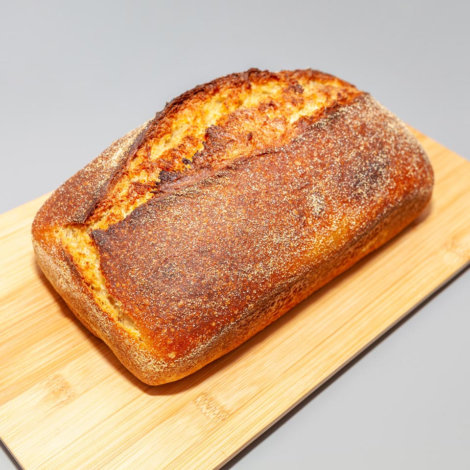
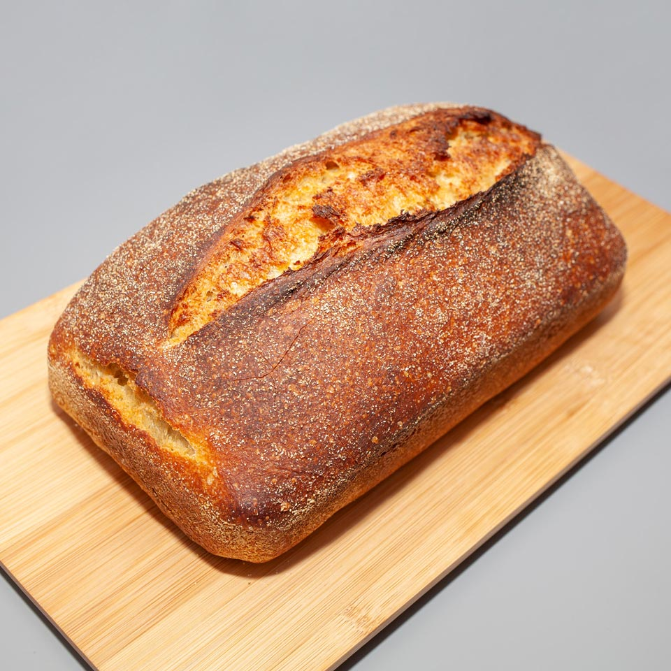
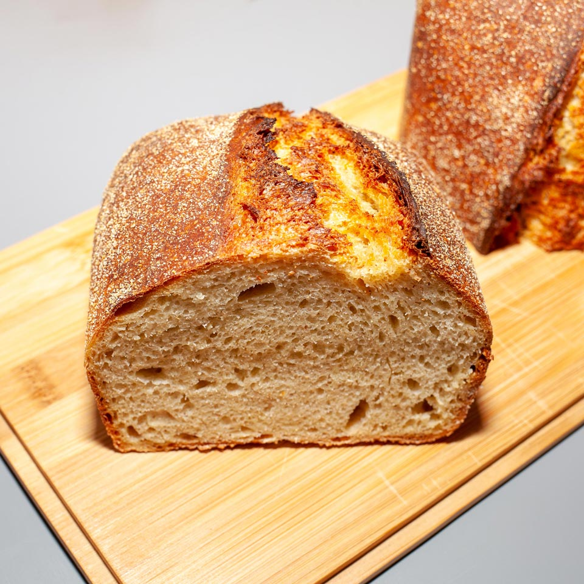

# Cornflour Sourdough Bread


Recipe for a cornflour sourdough loaf.

## Prerequisites

## Ingredients

| Weight | Ingredient        | Baker’s Percentage |
|--------|-------------------|--------------------|
| 100g   | Cornflour         | 20%                |
| 400g   | Bread flour       | 80%                |
| 330g   | Water             | 66%                |
| 80g    | Sourdough starter | 16%                |
| 10g    | Salt              | 2%                 |

Final dough temperature: **23°C**

## Tools

* sauce pan
* spatula
* meat thermometer
* two mixing bowls + dish towel
* dough scraper
* a handful of cornmeal
* loaf tin
* bread lame
* oven
* lava stones + roasting pan
* old dish towels + baking pan
* water spray bottle

## Timeline

### Day 1

* **20:00** [Pre-cook Flour](#pre-cook-flour)
* **21:00** [Autolyse](#autolyse)
* **21:30** [Mix](#mix)
* **21:35** [Bulk Fermentation](#bulk-fermentation)

### Day 2

* **08:30** [Preshape](#preshape)
* **08:40** [Shape](#shape)
* **08:45** [Proof](#proof)
* **10:45** [Preheat](#preheat)
* **11:45** [Bake](#bake)

## Method

### Pre-cook Flour

In a smaller sauce pan, heat 100g of water to 65°C and remove from heat. Gradually stir in 100g of cornflour, until you are left with a thick paste. Cover the sauce pan and leave it for an hour to cool down.

### Autolyse

Mix 400g of bread flour with the pre-cooked cornflour, and take its temperature with the thermometer (`Tf`). Next, take the temperature of your sourdough starter (`Ts`). Finally, check the ambient temperature of the room or the proofer where you will ferment the dough (`Ta`).

To reach the target dough temperature of 23°C, calculate the desired temperature of the water (`Tw`) via the following approx. formula:

```
Tw = (23 * 4) - (Tf + Ts + Ta)
```

Heat the 230g of water to the target temperature (`Tw`), and mix it with flour and 80g of your sourdough starter in a mixing bowl, until all dry bits are incorporated. Cover with a dish towel leave it to absorb the water.

### Mix

Spread 10g of salt on top of the dough, and splash a bit of water to dissolve it completely. Stretch & fold the dough for about 5 minutes in the bowl. If you feel adventurous you can also do the slap & fold technique. In the end, gently mould the dough in a ball and transfer it to a clean bowl and cover it with a dish towel.

### Bulk Fermentation

At 23°C, the bulk fermentation should take approx. 11 hours. The dough should visibly inflate (around 150-200% of the original size), and the surface should be show a bubble here and there.

### Preshape

Dump the dough on a clean, dry working surface, and with a wet dough scraper roll it into a boule. Try to avoid touching the sticky dough, and leave it uncovered for 10 minutes.

### Shape

Lightly flour the boule and the working surface with a bit of cornmeal (coarsely ground cornflour).

Use the dough scraper to lift and turn the dough over. Spread it a bit on both sides, and then lift the left side and fold it until the middle and tap lightly. Do it the same with the right side: lift and fold it until the middle and tap lightly. Then, gently lift the upper part of the dough, and start rolling it downwards, just like a towel. You can pause between the rolls, by gently tapping the dough on top to stay in place. Once you reach the end, stop and leave the seam on the bottom.

Lightly drizzle some oil on your loaf tin and then flour it with cornmeal on the bottom and sides. Lift the dough with the scraper and gently drop it in the tin which you will cover with the dish towel.

### Proof

At 23°C, final proof should take approx. 2 hours.

### Preheat

Put the lava stones in a roasting pan and insert it at the bottom of your oven. Preheat the oven to 230°C, with the lava stones inside.

About 20 minutes before the bake, fold the old dish towels in a baking pan and cover them fully with boiled water. Insert the pan in the bottom of the oven, and let it steam up nicely inside.

### Bake

Score the loaf with a single cut along the middle, for the length of the pan. Put the loaf tin on a rack above the pans, in the middle of the oven. Quickly, but safely, drop a glass of water on lava stones and spray a bit of water around the oven to increase the steam a bit.

Bake at 230°C for 20 minutes, the loaf should rise significantly, and rise above the edge of the tin. After 20 minutes, remove both pans from the oven and decrease the temperature to 210°C. Bake for another 30 minutes, until golden brown or to your liking. In case your oven is not heating evenly, you can also rotate the pan after 15 minutes.

After the bake, remove the loaf from the tin as soon as possible, and cool on a wire rack for at least 2 hours before cutting in.

## Result

[](https://www.instagram.com/p/CM-IE_RHxbu/)
[](https://www.instagram.com/p/CM-IE_RHxbu/)
[](https://www.instagram.com/p/CM-IE_RHxbu/)
